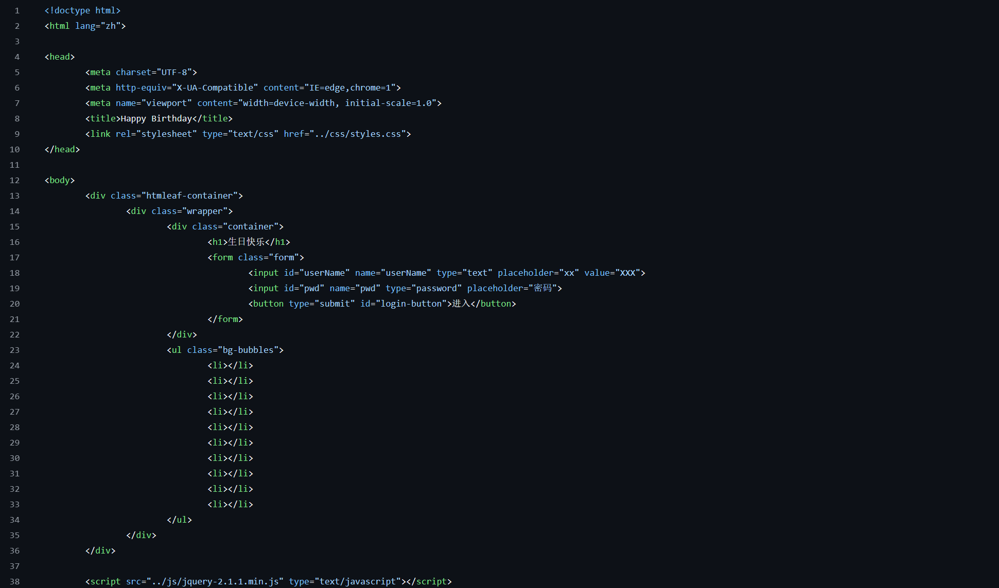
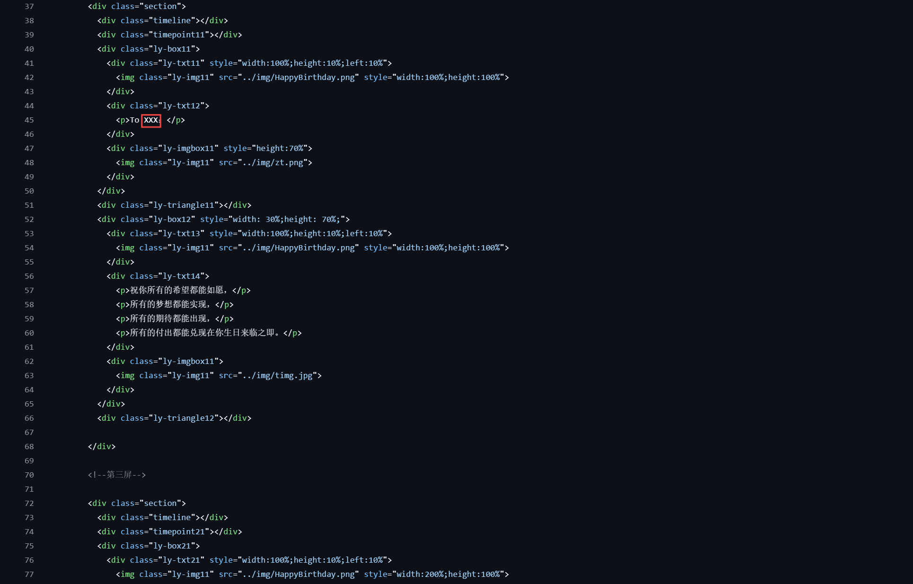
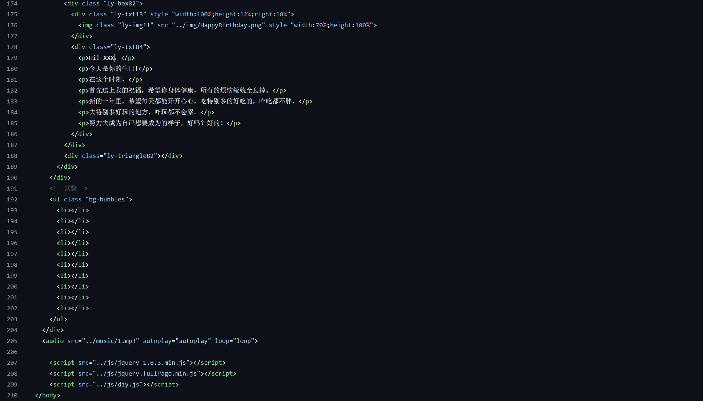
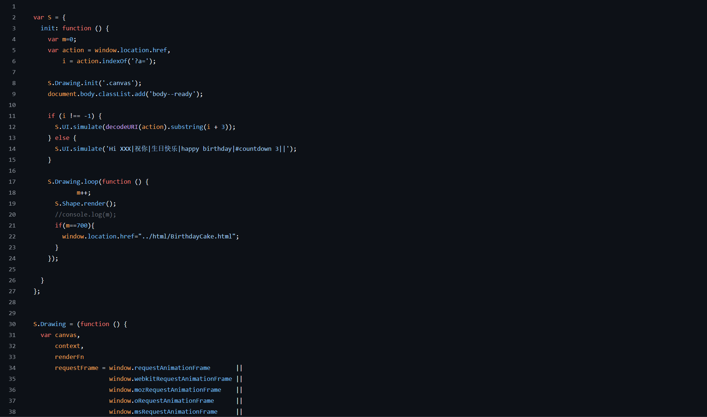

# 本项目为生日祝福网站搭建

项目参考：[HTML生日祝福代码精致版](https://www.bilibili.com/video/BV1MK411m7Wk/?spm_id_from=333.1391.0.0&vd_source=348051f774b468b1bd9ef0632cd78865)

在原有的代码上进行了一些更改

## 使用方法

  -  将项目克隆到你的本地文件夹中 

  -  对项目进行修改：（将“XXX”更改为被祝福人的名字）

  1 . login.html
  
  
    
  2. Memories.html

  

  

  3. indexl.js

  

  4. jquery-1.8.4.min

  

  -  可根据需要，对网页的图片进行更换（自行琢磨）
