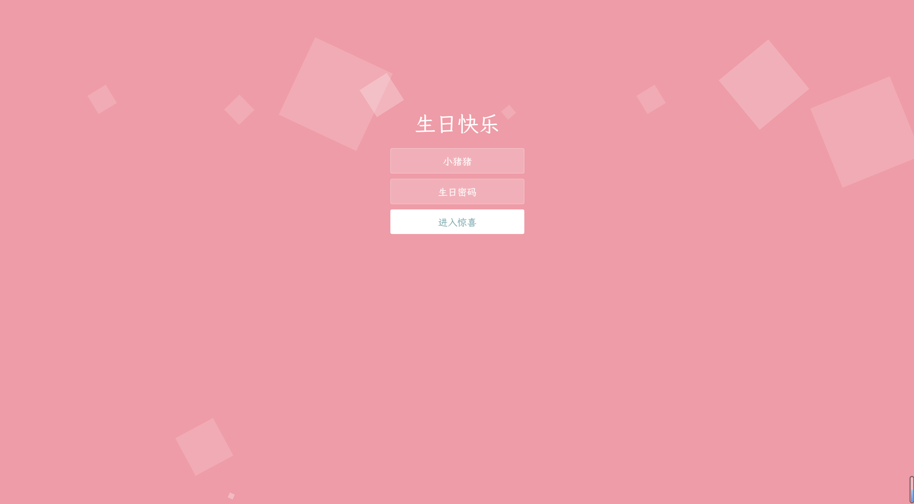

# 🎂 Happy Birthday 网站模板

> 一个精美的生日快乐祝福网站模板，通过简单配置即可创建个性化的生日祝福网站，为亲朋好友带来惊喜和感动！


---

## 📌 目录
- [功能特性](#-功能特性)
- [界面预览](#-界面预览)
- [安装与使用](#-安装与使用)
- [技术栈](#%EF%B8%8F-技术栈)
- [项目结构](#-项目结构)
- [自定义指南](#-自定义指南)
- [使用场景](#-使用场景)
- [许可证](#-许可证)

---

## ✨ 功能特性
| 特性 | 说明 |
|------|------|
| 🎨 **个性化定制** | 通过配置文件轻松修改祝福文字、图片和音乐 |
| 📱 **多屏滚动展示** | 采用全屏滚动设计，多屏展示不同祝福内容 |
| 🎵 **背景音乐** | 每个页面可配置专属背景音乐，增添氛围 |
| 📷 **图片自适应** | 图片自动缩放和居中显示，确保良好视觉效果 |
| 🔒 **密码保护** | 可设置简单密码保护，增加惊喜感和神秘感 |

---

## 🎨 界面预览

| 生日验证 | 生日蛋糕 | 生日祝福 |
|---------|-----------|----------|
|  |  |  |

---

## 🚀 安装与使用

### 1️⃣ 环境准备
```bash
# 确保安装了Node.js 14+
npm --version
```

### 2️⃣ 安装依赖
```bash
# 克隆仓库（如果适用）
# git clone [repository-url]
cd Happy_Birthday

# 安装项目依赖
npm install
```

### 3️⃣ 生成网站
```bash
# 将构建配置文件重命名
mv plopfile.js.txt plopfile.js

# 生成静态网站文件
npx plop g
```

### 4️⃣ 本地预览
```bash
# 进入生成的目录
cd dist

# 使用静态文件服务器预览
npx http-server

# 或者直接双击index.html文件
```

---

## 🛠️ 技术栈

| 分类 | 技术 | 版本 | 说明 |
|---|---|---|---|
| 运行环境 | Node.js | 14+ | JavaScript运行环境 |
| 构建工具 | Plop.js | 4.0+ | 代码生成与自动化工具 |
| 模板引擎 | Handlebars | 4.7+ | 高效的HTML模板渲染 |
| 配置文件 | YAML | 4.1+ | 结构化配置数据 |
| 前端框架 | jQuery | 1.8+ | DOM操作与动画 |
| 样式技术 | CSS3 | - | 现代样式与动画效果 |
| 路径处理 | fs-extra | 11.3+ | 增强的文件系统操作 |

---

## 📁 项目结构
```
Happy_Birthday/
├── config.yaml        # 配置文件（自定义内容）
├── dist/              # 运行后生成的静态网站文件
├── templates/         # 模板文件
│    ├── html/          # HTML模板
│    ├── js/           # JavaScript模板
│    ├── css/           # CSS模板
│    ├── img/           # 图片模板
│    ├── music/         # 音乐模板
│    ├── woff/          # 字体文件
│    └── index.hbs      # 入口HTML模板
├── package.json       # 项目依赖配置文件
└── plopfile.js.txt     # 构建配置文件(txt)
```

---

## 🎨 自定义指南

### 修改基本信息
在 `config.yaml` 文件中修改以下内容：

```yaml
- title: 网站标题
- To_name: 祝福对象的名字
- from_name: 送祝福的名字
- crypto: 登录密码
- font_animation: 文字动画配置
- music: 页面背景音乐配置
- screens: 各屏幕的文字和图片内容
```

### 修改祝福内容
编辑 `config.yaml` 文件中的 `screens` 部分，修改每个页面的文字和图片：

```yaml
screens:
  # 第一屏
  screen1:
    messages1:
      - "愿你能精致到老，眼里满是星光。"
      - "开朗面对生活，笑里全是坦荡。"
```

### 更换图片
1. 将新图片放在 `templates/img/` 目录下
2. 在 `config.yaml` 中更新图片路径：

```yaml
screens:
  screen2:
    image1: "/templates/img/your-image.jpg"
```

### 更换音乐
1. 将新音乐文件放在 `templates/music/` 目录下
2. 在 `config.yaml` 中更新音乐路径：

```yaml
music:
  Memories: "/templates/music/your-music.mp3"
```

---

## 🎂 使用场景
- 为朋友、家人创建个性化生日礼物
- 制作电子贺卡分享美好祝福
- 纪念日、节日等特殊场合的电子礼物
- 表白、求婚等重要时刻的创意表达

---

## 📝 许可证
[MIT License](LICENSE) © 2024 Happy Birthday Project

---

## 💡 提示
- 图片建议使用适合网页显示的尺寸和格式（如JPG、PNG）
- 音乐文件建议使用MP3格式，注意文件大小
- 可通过修改模板文件进一步自定义页面样式
- 如果在移动设备上访问，建议连接Wi-Fi以获得最佳体验
        